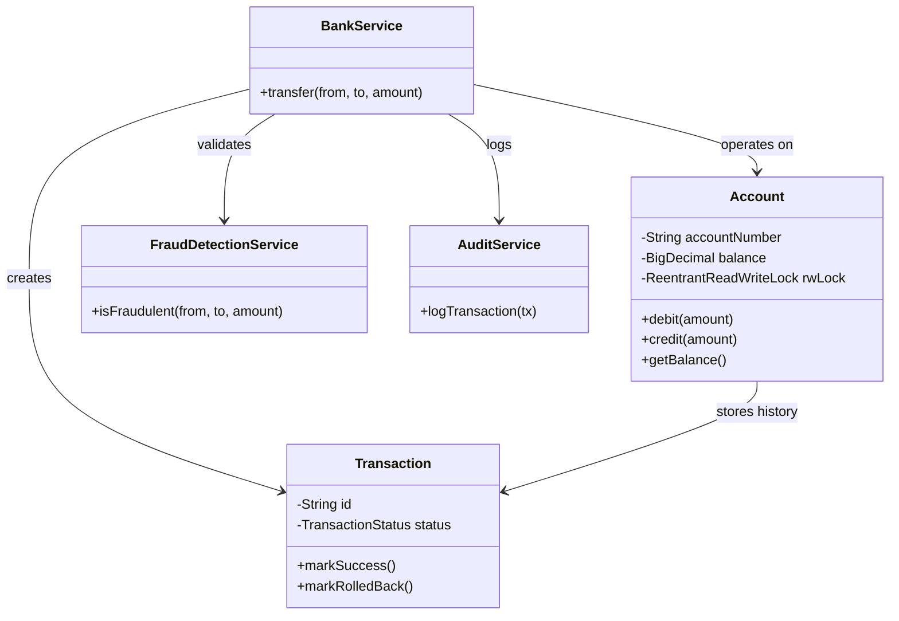

# Banking Transaction Simulator - Advanced Design

## High-Level Architecture

The system is designed as a layered architecture to ensure separation of concerns and scalability.

## Concurrency Strategy

To support high throughput and correctness, we use an **Optimistic/Pessimistic hybrid locking strategy**:

1.  **Account-Level Locking**: Each `Account` owns a `ReentrantReadWriteLock`.
    *   **Read Lock**: Used for `getBalance()` and history viewing. Allows multiple concurrent readers (e.g., UI dashboards, audits).
    *   **Write Lock**: Used for `debit()` and `credit()`. Exclusive access ensures atomicity.
2.  **Deadlock Prevention**:
    *   **Lock Ordering**: When transferring between two accounts, locks are always acquired in a deterministic order (lexicographically by account number). This prevents the "Dining Philosophers" problem where A waits for B and B waits for A.
    *   **Try-Lock with Timeout**: As an advanced safety measure, `BankService` uses `tryLock(timeout)` instead of indefinite waiting. If a lock cannot be acquired, the operation aborts gracefully rather than hanging the system.
3.  **Atomicity**: Both accounts are locked *before* any balance modification occurs. If any step fails (e.g., insufficient funds), the transaction rolls back (no changes persisted) and locks are released.

## Advanced Features

*   **Fraud Detection**: Pre-transfer validation rules (e.g., max limits, blacklists).
*   **Asynchronous Auditing**: `AuditService` runs on a separate thread to prevent logging I/O from blocking critical financial transactions.
*   **Repository Pattern**: `AccountRepository` and `TransactionRepository` abstract the data storage (currently in-memory, but easily swappable for SQL/NoSQL).

## SOLID Principles

*   **SRP**: `Account` manages state, `BankService` manages logic, `AuditService` manages logging.
*   **OCP**: `FraudDetectionService` is designed to be easily extended with new rules without modifying `BankService`.
*   **LSP**: Derived exceptions and services follow contract behaviors.
*   **ISP**: Interfaces are focused (implied by service granularity).
*   **DIP**: `BankService` depends on service abstractions (in a real Spring app, these would be interfaces injected via constructor).
