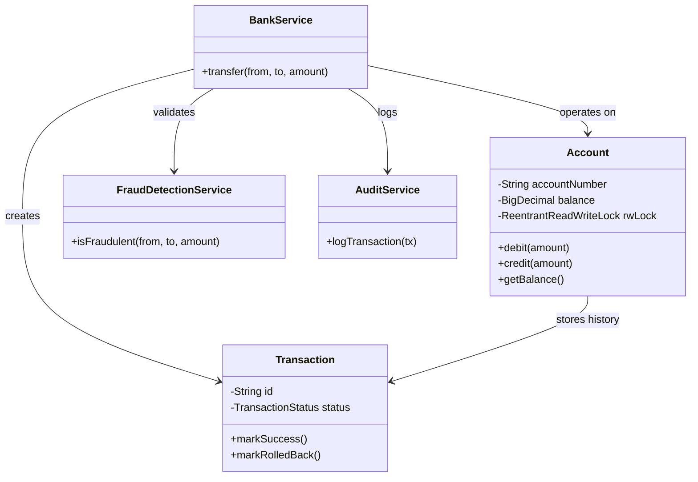

# High-Performance Banking Transaction Simulator

> A high-concurrency financial transaction simulator featuring deadlock-free pessimistic locking, asynchronous auditing, and atomic rollback mechanisms.

## 🚀 Overview

This project demonstrates advanced Java concurrency patterns by simulating a banking core that handles high-frequency financial transactions. It is designed to ensure strict **data integrity (ACID)** while maximizing throughput using fine-grained locking strategies.

Unlike simple simulations, this system handles:
*   **Race Conditions**: Preventing lost updates when multiple threads debit the same account.
*   **Deadlocks**: Using deterministic lock ordering to allow safe bidirectional transfers.
*   **Fraud Detection**: Real-time pre-transaction validation.
*   **Audit Logging**: Asynchronous, non-blocking history recording.

## ✨ Key Features

*   **Thread-Safe Architecture**: Utilizes `ReentrantReadWriteLock` to allow multiple concurrent readers (balance checks) while protecting writers (transfers).
*   **Atomic Transactions**: Ensures all-or-nothing execution. If any step fails (insufficient funds, fraud), the entire transaction rolls back.
*   **Deadlock Prevention**: Implements Lexicographical Lock Ordering to guarantee that threads never wait circularly for resources.
*   **Asynchronous Auditing**: Decouples IO-heavy logging from the critical business logic path using `ExecutorService`.
*   **Fraud Detection Engine**: Intercepts and validates transactions against rule sets (e.g., maximum limits, blacklists).

## 🛠 Tech Stack

*   **Language**: Java 17+
*   **Concurrency**: `java.util.concurrent` (Executors, ReentrantReadWriteLock, Atomic References)
*   **Design Patterns**: Repository, Service Layer, Strategy (Fraud Rules), Dependency Injection (Constructor-based).

## 🏗 Architecture

The system follows a clean Separation of Concerns, visualized below:



### 📂 Project Structure

```text
src/main/java/com/bank/simulator
├── exception/
│   └── InsufficientFundsException.java
├── model/
│   ├── Account.java
│   ├── Transaction.java
│   └── TransactionStatus.java
├── repository/
│   ├── AccountRepository.java
│   └── TransactionRepository.java
├── service/
│   ├── AuditService.java
│   ├── BankService.java
│   ├── FraudDetectionService.java
│   ├── InterestService.java
│   └── StorageService.java
├── ui/
│   └── DashboardServer.java
└── BankingSimulator.java
```

*For a deep dive into the locking strategy and concurrency control, see [DESIGN.md](DESIGN.md).*

## ⚡ How to Run

### Prerequisities
*   Java JDK 8 or higher.

### Compilation & Execution
Since this is a pure Java project without build tools (Maven/Gradle), you can compile and run it directly:

```bash
# 1. Compile all sources
javac -d out src/main/java/com/bank/simulator/exception/*.java src/main/java/com/bank/simulator/model/*.java src/main/java/com/bank/simulator/repository/*.java src/main/java/com/bank/simulator/service/*.java src/main/java/com/bank/simulator/*.java

# 2. Run the main Simulation
java -cp out com.bank.simulator.BankingSimulator
```

## 📊 Example Output

The simulator runs 50 concurrent transfers, 20 concurrent readers, and simulated fraud attempts.

```text
=== Starting Advanced Banking Simulator ===
[AUDIT] Logged: Transaction{id='...', src='A1001', dest='A1002', amt=10, stat=SUCCESS}
...
FRAUD DETECTED: Transfer of 50000 exceeds threshold.
Expected High Value Warning: Transaction rejected by fraud detection
...
=== Simulation Complete ===
Final Balance Alice (A1001): 750
Final Balance Bob   (A1002): 1250
Final Balance Charlie(A1003): 2000
Final Balance EvilCorp(BLK): 0
Total System Liquidity: 4000
SUCCESS: Total liquidity matches initial state. Atomicity preserved.
```
